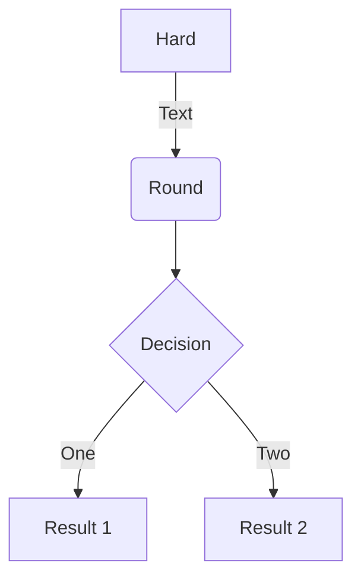

# Mkdocs markdown extension syntax examples

## Arithmatex
- `pymdownx.arithmatex`
- Inline: `$p(x|y) = \frac{p(y|x)p(x)}{p(y)}$, \(p(x|y) = \frac{p(y|x)p(x)}{p(y)}\).`
  - $p(x|y) = \frac{p(y|x)p(x)}{p(y)}$, \(p(x|y) = \frac{p(y|x)p(x)}{p(y)}\).
- Block:
```
$$
E(\mathbf{v}, \mathbf{h}) = -\sum_{i,j}w_{ij}v_i h_j - \sum_i b_i v_i - \sum_j c_j h_j
$$

\[3 < 4\]

\begin{align}
    p(v_i=1|\mathbf{h}) & = \sigma\left(\sum_j w_{ij}h_j + b_i\right) \\
    p(h_j=1|\mathbf{v}) & = \sigma\left(\sum_i w_{ij}v_i + c_j\right)
\end{align}
```

$$
E(\mathbf{v}, \mathbf{h}) = -\sum_{i,j}w_{ij}v_i h_j - \sum_i b_i v_i - \sum_j c_j h_j
$$

\[3 < 4\]

\begin{align}
    p(v_i=1|\mathbf{h}) & = \sigma\left(\sum_j w_{ij}h_j + b_i\right) \\
    p(h_j=1|\mathbf{v}) & = \sigma\left(\sum_i w_{ij}v_i + c_j\right)
\end{align}
## BetterEm

```
This * won't emphasize *

This *will emphasize*

___A lot of underscores____________is okay___

```

This * won't emphasize *

This *will emphasize*

___A lot of underscores____________is okay___

### Blocks

/// admonition | Some title
Some content
///

/// admonition | Some title
    type: warning

Some content
///

/// note | Some title
Some content
///

Fruit      | Amount
---------- | ------
Apple      | 20
Peach      | 10
Banana     | 3
Watermelon | 1

/// caption
Fruit Count
///



/// figure-caption
Decision Diagram
///

Fruit      | Amount
---------- | ------
Apple      | 20
Peach      | 10
Banana     | 3
Watermelon | 1

/// table-caption
Fruit Count
///

/// define
Apple

- Pomaceous fruit of plants of the genus Malus in
  the family Rosaceae.

///

/// define
Apple

- Pomaceous fruit of plants of the genus Malus in
  the family Rosaceae.

Orange

- The fruit of an evergreen tree of the genus Citrus.

///

## Tasklist
Task List

-   [X] item 1
    *   [X] item A
    *   [ ] item B
        more text
        +   [x] item a
        +   [ ] item b
        +   [x] item c
    *   [X] item C
-   [ ] item 2
-   [ ] item 3

## ProgressBar
[=85% "85%"]{: .candystripe}
[=100% "100%"]{: .candystripe .candystripe-animate}

[=0%]{: .thin}
[=5%]{: .thin}
[=25%]{: .thin}
[=45%]{: .thin}
[=65%]{: .thin}
[=85%]{: .thin}
[=100%]{: .thin}

## admonition

!!! note "Ghi chú"
    Đây là một ghi chú quan trọng

!!! tip "Mẹo hay"
    Đây là một mẹo hữu ích

!!! warning "Cảnh báo"
    Hãy cẩn thận với điều này

!!! danger "Nguy hiểm"
    Điều này rất quan trọng!

!!! success "Thành công"
    Bạn đã hoàn thành!

!!! failure "Lỗi"
    Có lỗi xảy ra

!!! bug "Lỗi phần mềm"
    Đây là một bug cần sửa

!!! example "Ví dụ"
    Đây là một ví dụ minh họa

!!! quote "Trích dẫn"
    "Đây là một câu trích dẫn"

!!! question "Câu hỏi"
    Bạn có thắc mắc gì không?

!!! info "Thông tin"
    Thông tin bổ sung

!!! abstract "Tóm tắt"
    Tóm tắt nội dung chính
## References 

- PyMdown Extensions Documentation: https://facelessuser.github.io/pymdown-extensions/